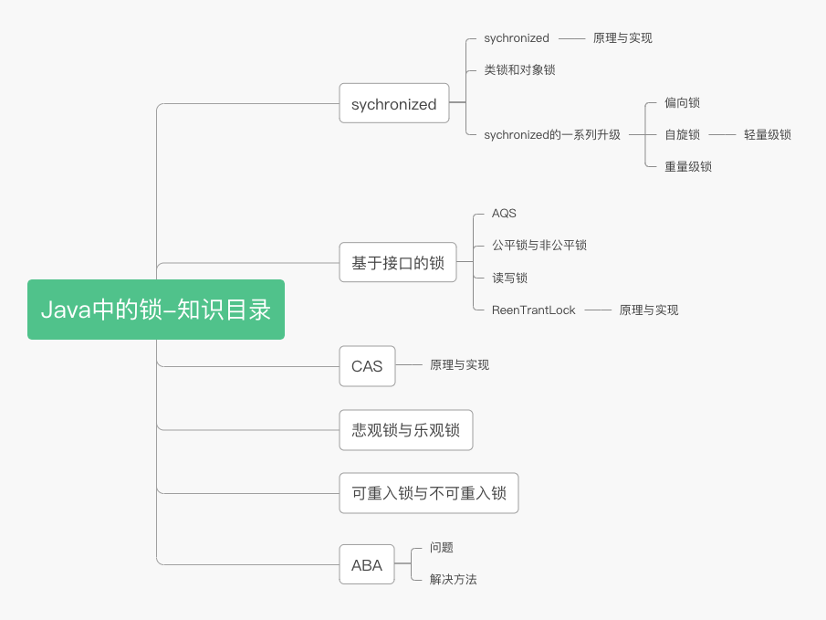
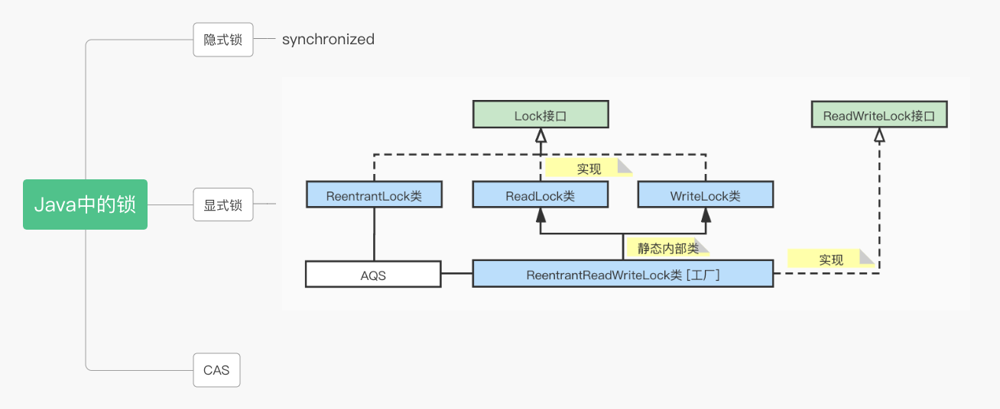
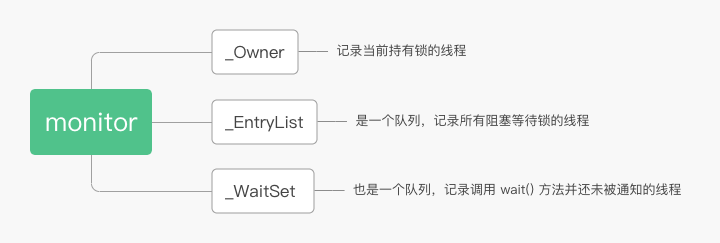

# Java中的锁



## 1. Java中的锁

- 一种是synchronized关键字，使用简单
- 一种是Lock和ReadWriteLock接口的实现类，主要实现类分别为**ReentrantLock 和 ReentrantReadWriteLock**，这两个类都是基于**AQS**(AbstractQueuedSynchronizer) 实现的。
- CAS也可以称为一种锁，在包括 AQS 在内的很多并发相关类中，CAS 都扮演了很重要的角色。



## 2. sychronized

### 2.1. 概述

是一种悲观锁（独占锁）。在修饰静态方法时，锁的是类对象Object.class；在修饰非静态方法时锁的是对象this；修饰方法块时，锁的是括号里的对象。

每个对象有一个锁和一个等待队列，锁只能被一个线程持有，其他需要的线程阻塞等待。锁释放后，会从队列里取出一个线程来唤醒，取出哪一个是随机的，不保证公平性。

#### 2.1.1. 类锁和对象锁

sychronized在修饰静态方法时，锁的是类对象Object.class；在修饰非静态方法时锁的是对象this。多个线程是可以同时执行同一个sychronized实例方法的，只要访问的对象不同即可。

**sychronized锁的是对象而不是代码！**

一般在锁某个变量时，要把所有访问该变量的方法都加上sychronized。

### 2.2. sychronized的实现

基于Java对象头和Monitor机制实现

#### 2.2.1. Java对象头

首先，一个对象在内存中由三部分组成：

对象头，实例数据，对齐填充

Java对象头由两部分组成：

Class Metadata Address（类型指针），Mark Word（标记字段）

类型指针存储元数据的指针，JVM通过这个指针知道这个对象是那个类的实例

标记字段，存一些对象运行时的数据，包括，hashcode，gc年龄，**锁状态**

标记字段有一个字段指向monitor对象，monitor中记录锁的持有线程，等待的线程队列。**上文说的每个对象有一个锁和一个等待队列就是在这里实现的**。

#### 2.2.2. monitor操作机制

monitor对象有三个关键字段



- 多个线程竞争锁时，会先进入 EntryList 队列。竞争成功的线程被标记为 Owner。其他线程继续在此队列中阻塞等待。
- 如果 Owner 线程调用 wait() 方法，则其释放对象锁并进入 WaitSet 中等待被唤醒。Owner 被置空，EntryList 中的线程再次竞争锁。
- 如果 Owner 线程执行完了，便会释放锁，Owner 被置空，EntryList 中的线程再次竞争锁。

#### 2.2.3. JVM对sychronized的处理

JVM将monitor和sychronized联系在一起的方式

- 对于同步代码块

  在代码块之前加monitorenter，之后加monitorexit指令

- 对于方法

  为方法设置 ACC_SYNCHRONIZED 标志。调用的时候 JVM 根据这个标志判断是否是同步方法。

### 2.3. sychronized的一系列升级

无锁 - 偏向锁 - 轻量级锁 - 重量级锁

轻量级锁是一种自旋锁

本节会介绍偏向锁，自旋锁的概念。本节字很多，但是很重要。

- 初次执行sychronized代码块，状态从无锁变为**偏向锁**（通过CAS修改对象头里的锁标志位），偏向锁字面意思就是“偏向于第一个获得它的线程”的锁。

  执行完同步代码块之后，线程不会主动释放偏向锁。当第二次到同步代码块时，线程会判断此时持有锁的线程是否是自己（持有锁的线程id也在对象头里），如果是则正常执行 （持锁线程竟是我自己emmm）；由于之前没有释放锁，这里也就不用重新加载锁。

- 当引入第二个锁加入竞争，偏向锁就升级为了轻量级锁（**自旋锁**）。

  锁竞争：多个线程轮流获取一个锁，**且发生占用等待时**，才叫发生了锁竞争。如果这些线程每次获得锁都很顺利，则不算锁竞争。

  在轻量级锁状态下继续锁竞争，**没有获得锁的线程将自旋**，就是不停地循环去判断能否获得锁（得不到的永远在骚动emmm）。

  获取锁的操作：通过CAS修改对象头里的锁标识位。先验证锁标志位是否为释放，是则将其设置为“锁定”，CAS是原子性发生的，这就算是抢到锁了。然后线程会将当前锁的持有者信息修改为自己。

- 锁在自旋时的状态叫忙等（BUSY-WAITING)，光等着抢占锁了，不干别的活，这好吗？这不好。因此，只有在未发生锁竞争或者说发生轻微锁竞争时，才会使用自旋锁，允许短时间的忙等状态出现。

- 然而，对忙等的时间（或者说，自旋的次数）是有忍耐限度的。如果锁竞争严重，某个达到最大自旋次数的线程，会讲锁升级为**重量级锁**（依然用CAS修改锁标志位），但是不再修改持锁id。当其他线程尝试获取锁时，发现是重量级锁，直接将自己挂起（而不是忙等，铁定拿不到，干脆躺了），等待被唤醒。

- 一个锁只能按照 无锁 - 偏向锁 - 轻量级锁 - 重量级锁 的顺序升级。

- 总结就是，只有当竞争升级时，锁才会升级。

从 无锁 - 偏向锁 - 轻量级锁 - 重量级锁 来看，锁是升级的，但是换个角度，**这其实是JDK对锁的一系列优化！**

在JDK1.6之前，sychronized直接加重量级锁，开销很大，之后出现了自旋锁这些，层层加码，而不是一开始就上重量级锁，优化了性能。

## 3. AQS

### 3.1. 概述

Abstract Queued Synchronizer

AQS 中有两个重要的成员：

- 成员变量 state。用于表示锁现在的状态，用 volatile 修饰，保证内存一致性。同时所用对 state 的操作都是使用 CAS 进行的。state 为0表示没有任何线程持有这个锁，线程持有该锁后将 state 加1，释放时减1。多次持有释放则多次加减。
- 双向链表。链表除了头结点外，每一个节点都记录了线程的信息，代表一个等待线程。这是一个 FIFO 的链表。

### 3.2. 公平锁和非公平锁

公平锁，各个线程在加锁之前，先检查有没有排队的锁，按排队顺序去获得锁。

非公平锁，线程在加锁之前不考虑排队问题，直接尝试去获得锁，获取不到再去队尾排队。

### 3.3. AQS的原理

下面以 ReentrantLock 非公平锁的代码看看 AQS 的原理。

- 请求锁

请求锁时有三种可能：

1. 如果没有线程持有锁，则请求成功，当前线程直接获取到锁。
2. 如果当前线程已经持有锁，则使用 CAS 将 state 值加1，表示自己再次申请了锁，释放锁时减1。这就是可重入性的实现。
3. 如果由其他线程持有锁，那么将自己添加进等待队列。

如果没竞争到锁，这时候就要进入等待队列。队列是默认有一个 head 节点的，并且不包含线程信息。上面情况3中，addWaiter 会创建一个 Node，并添加到链表的末尾，Node 中持有当前线程的引用。同时还有一个成员变量 waitStatus，表示线程的等待状态，初始值为0。我们还需要关注两个值：

CANCELLED，值为1，表示取消状态，就是说我不要这个锁了，请你把我移出去。

SINGAL，值为-1，表示下一个节点正在挂起等待，注意是下一个节点，不是当前节点。

同时，加到链表末尾的操作使用了 CAS+死循环的模式。

- 释放锁

如果当前线程是持有锁的线程，就将 state 减1。减完后如果 state 大于0，表示当前线程仍然持有锁，返回 false。如果等于0，表示已经没有线程持有锁，返回 true，进入下一步；

如果头部节点的 waitStatus 不等于0，则调用LockSupport.unpark()唤醒其下一个节点。头部节点的下一个节点就是等待队列中的第一个线程，这反映了 AQS 先进先出的特点。另外，即使是非公平锁，进入队列之后，还是得按顺序来。

对于公平锁来说，区别就是在竞争锁之前判断一下等待队列中有没有线程在等待就行了。

## 4. ReentrantLock

实现了和 synchronized 一样的语义，包括可重入、保证内存可见性、解决竞态条件问题等。相比 synchronized，它还有如下好处：

- 支持以非阻塞方式获取锁
- 可以响应中断
- 可以限时
- 支持了公平锁和非公平锁

```java
// ReentrantLock 的 demo
public class Counter {
    private final LOCK lock = new ReentrantLock();
    private volatile int count;
   
    public void increase() {
        lock.lock();
        try {
            count ++;
        }
        finally {
            lock.unlock();
        }
    }
  
    public int getCount() {
        return count;
    }
}
```

ReentrantLock 内部有两个内部类，分别是 FairSync 和 NoFairSync，对应公平锁和非公平锁。他们都继承自 Sync。Sync 又继承自AQS。

## 5. 读写锁

读写锁有一个读锁和一个写锁，分别对应读操作和锁操作。锁的特性如下：

只有一个线程可以获取到写锁。在获取写锁时，只有没有任何线程持有任何锁才能获取成功；

如果有线程正持有写锁，其他任何线程都获取不到任何锁；

没有线程持有写锁时，可以有多个线程获取到读锁。

上面锁的特点保证了可以并发读取，这大大提高了效率。（和MySQL中的读写锁时一个意思）

原理：

读写锁虽然有两个锁，但实际上只有一个等待队列。

获取写锁时，要保证没有任何线程持有锁；

写锁释放后，会唤醒队列第一个线程，可能是读锁和写锁；

获取读锁时，先判断写锁有没有被持有，没有就可以获取成功；

获取读锁成功后，会将队列中等待读锁的线程挨个唤醒，知道遇到等待写锁的线程位置；

释放读锁时，要检查读锁数，如果为0，则唤醒队列中的下一个线程，否则不进行操作。

## 6. CAS

CAS是一个概念

CAS是乐观锁的基础

Compare and Set 比较并设置

比较：对于值a，在将其更新为值b之前，检查其值是否仍然为a

设置：是，则将值更新为b；不是，则什么都不做

```java
// 乐观锁的一个简单demo

public void CASDemo() {
  int num = 666;
  boolean flag = true;
  
  while (flag) {
    oldNum = num;
    newNum = modify(oldNum);
    
    if (num == oldNum) {  // 比较
      num = newNum;  // 设置
    }
    else {}  // 什么也不做
  }
}

// 这个代码不是原子性的，知识为了展示CAS的流程

// TODO 总结操作的原子性
```

从demo可以看到，整个过程中其实并没有“加锁”和“解锁”操作，因此乐观锁策略被称为**无锁编程**。乐观锁策略其实不是“锁”，只是一个循环尝试CAS的算法。

CAS在 Unsafe 类中，调用代码：unsafe.compareAndSwapInt(this, valueOffset, expect, update);

AtomicInteger 的源码

```java
public final int incrementAndGet () {
    for (;;) {
        int current = get();
        int next = current + 1;
        if (compareAndSet(current, next))
            return next;
    }
}

// 使用一个死循环进行 CAS 操作，成功了就结束循环返回，失败了就重新从内存读取值和计算新值，再调用 CAS
// 这也是CAS的示范用法
```

## 7. 悲观锁和乐观锁

### 7.1. 概述

悲观锁和乐观锁指的是两种不同的加锁策略。

悲观锁和独占锁是一个意思，假设一定会发生冲突，在获得锁之后会阻塞其他等待线程。好处是简单安全，但是挂起线程和恢复线程需要转入内核态，性能开销大。

悲观锁的代表是**sychronized**。

在真实环境中，大部分时候冲突不会发生，悲观锁会造成浪费。

乐观锁假设不会发生冲突，先去执行某项操作，失败了再做其他处理。乐观锁不会阻塞其他线程，也不涉及到上下文切换，性能开销小。**乐观锁不加锁**，后面会详述。

乐观锁的代表是**CAS**。

悲观锁阻塞线程，适用于写操作多的情景；乐观锁回滚重试，适用于写操作少的情景。

### 7.2. 一些拓展

```markdown
内核态

# TODO
```

```marks
线程的上下文切换
CPU通过分配时间片来执行任务，当一个任务的时间片用完了，就会切换到另一个任务。
在切换之前会保存上一个任务的状态，当下次再切换到这个任务时，会加载这个状态。
总结就是，任务从保存到再加载的一次过程就是一次上下文切换

https://blog.csdn.net/dh554112075/article/details/90696768
```

## 8. 可重入锁和不可重入锁

可重入锁又叫递归锁，“可以重新进入的锁”，就是允许一个线程多次获得同一把锁。

按照递归的思路去理解的话，就是对一个函数加锁之后，这个函数在递归调用的时候，会阻塞自己吗，如果不会的话，这就是递归锁，也就是可重入锁。

以Reentrant开头的锁，Lock实现的锁，sychronized都是可重入锁。

## 9. ABA问题

CAS 保证了比较和交换的原子性。但是从读取到开始比较这段期间，其他核心仍然是可以修改这个值的。如果核心将 A 修改为 B，CAS 可以判断出来。但是如果核心将 A 修改为 B 再修改回 A。那么 CAS 会认为这个值并没有被改变，从而继续操作（来骗来偷袭我老CAS！）

解决方法：使用版本号。（异曲同工，MySQL里也用版本号解决兵法问题）

### 9.1. AtomicStampedReference

对于需要自己进行CAS处理的地方，我们可以使用“AtomicStampedReference”来进行数据的处理。它既支持泛型，同时还可以避免传统CAS中ABA的问题，使数据更加安全。

```java
private final static AtomicStampedReference<Integer> stamp = new AtomicStampedReference<>(100, 1);

stamp.compareAndSet(100, 200, stamp.getStamp(), stamp.getStamp() + 1);
stamp.compareAndSet(200, 100, stamp.getStamp(), stamp.getStamp() + 1);

```

`AtomicStampedReference`主要是使用CAS机制更新新的值reference和时间戳stamp。而最终调用的底层是一个本地的方法对数据进行的修改。

```java
public final native boolean compareAndSwapObject(Object var1, long var2, Object var4, Object var5);
```

## 10. sychronized和ReentrantLock的区别

- Lock是一个接口，属于JDK层面的实现；而synchronized属于Java语言的特性，其实现有JVM来控制（代码执行完毕，出现异常，wait时JVM会主动释放锁）。
- synchronized在发生异常时，会自动释放掉锁，故不会发生死锁现(此时的死锁一般是代码逻辑引起的)；而Lock必须在finally中主动unlock锁，否则就会出现死锁。
- Lock能够响应中断，让等待状态的线程停止等待；而synchronized不行。
  通过Lock可以知道线程是否成功获得了锁，而synchronized不行。
- Lock提高了多线程下对读操作的效率。

## 11. 参考资料

https://zhuanlan.zhihu.com/p/71156910

https://blog.csdn.net/ly199108171231/article/details/88098614
